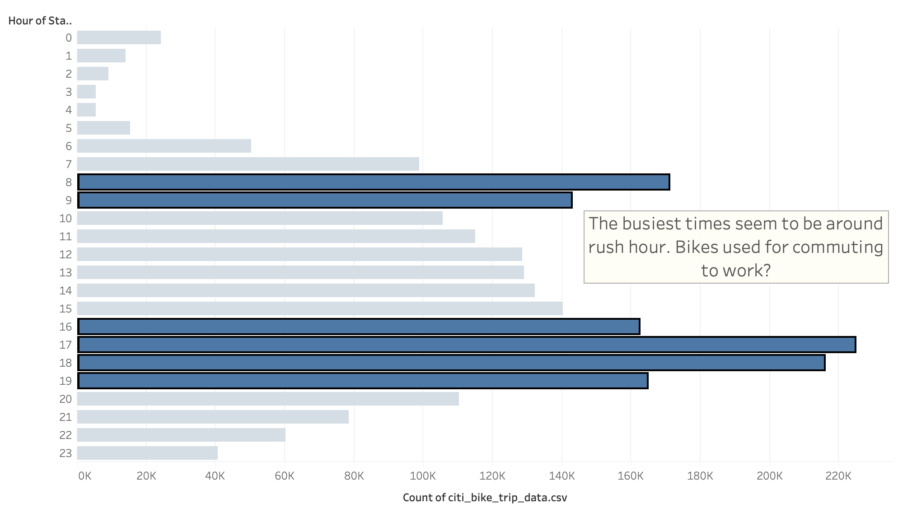
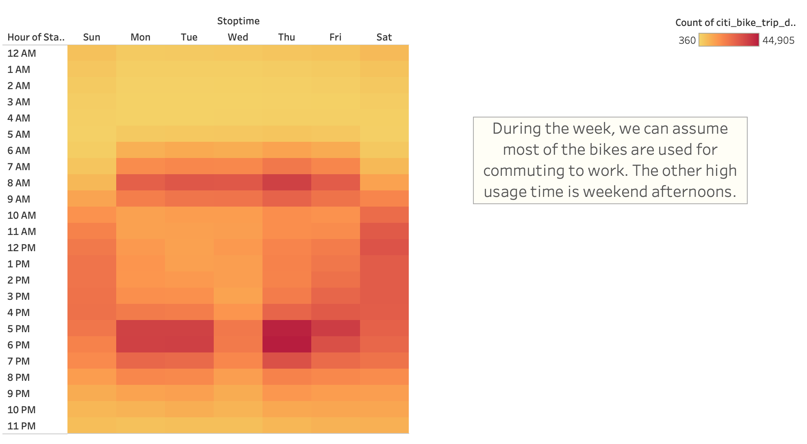
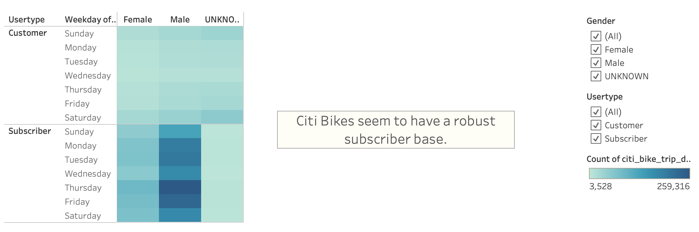
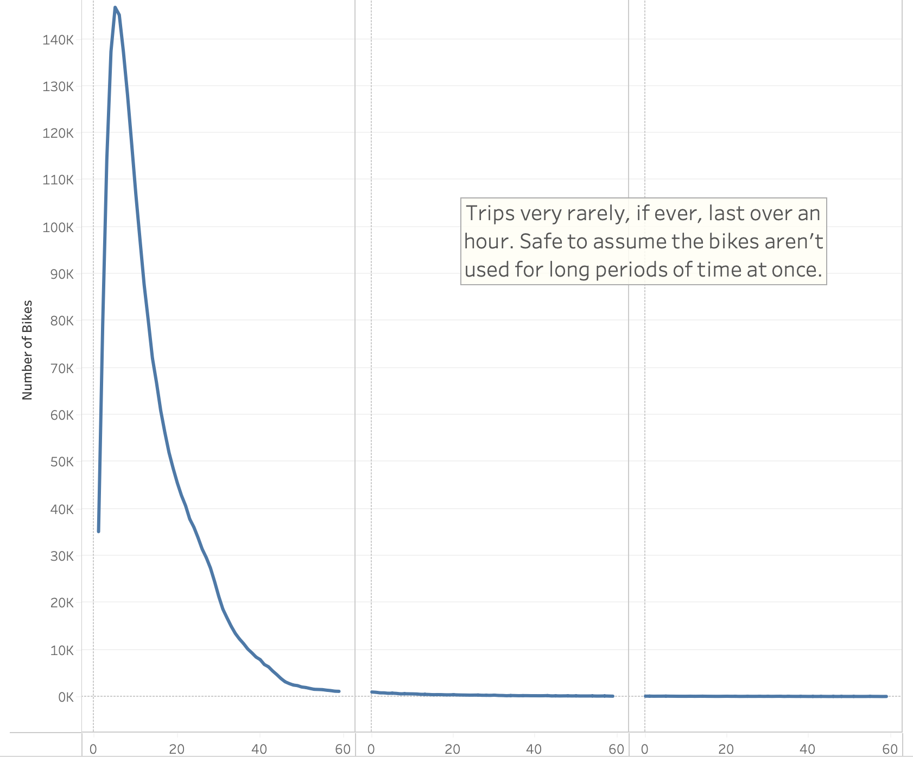
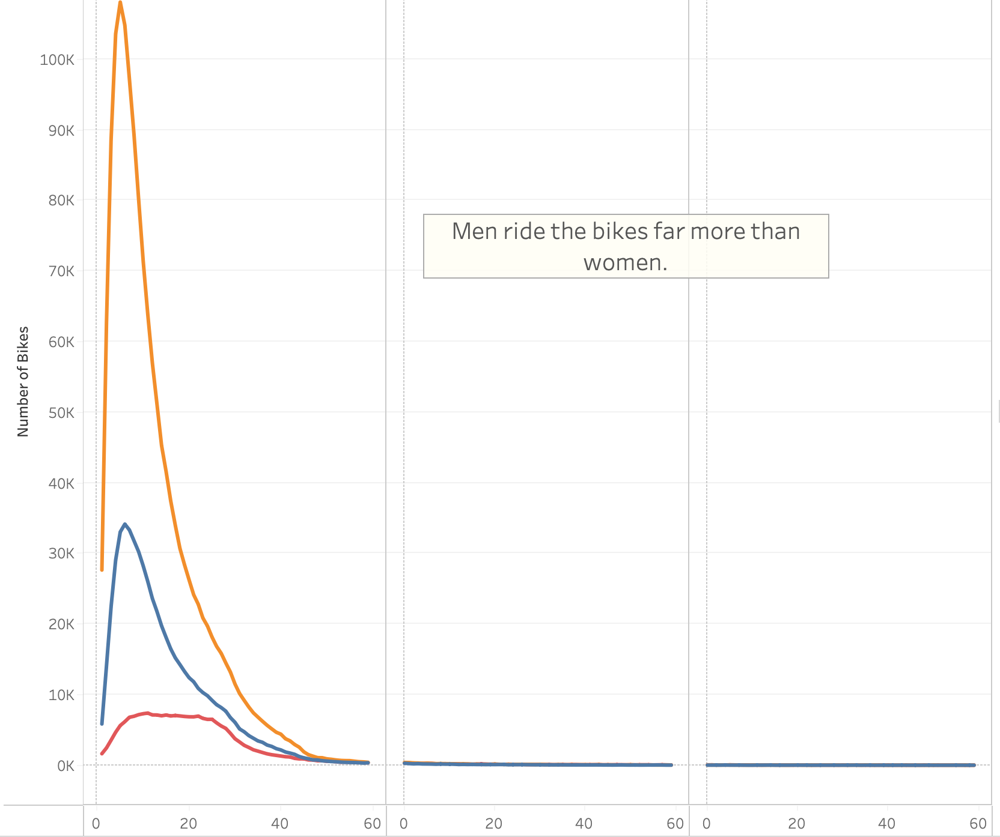
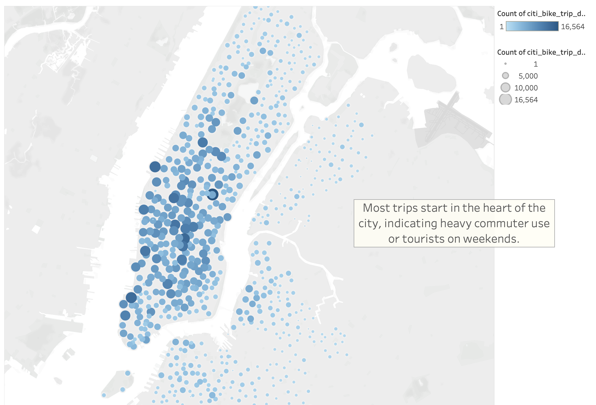
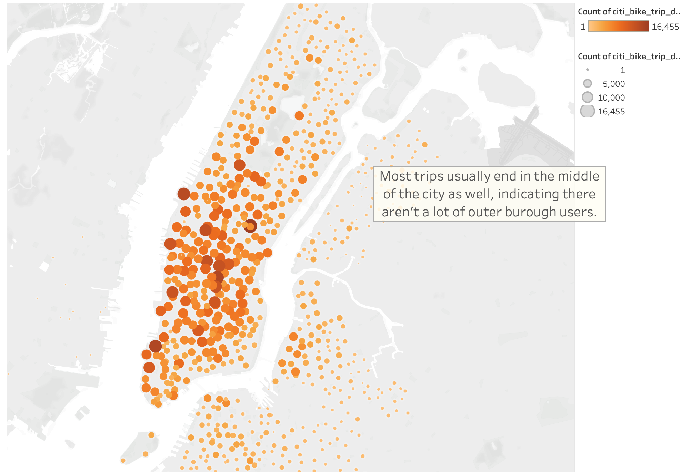

# Citi Bike Research
## Overview
### Purpose
After an exciting trip to New York City with my friend Kate, we started looking through photos and realized how big an impact the use of Citi Bikes had on our experience. Following a discussion, we decided we wanted to explore the possibility of starting our own bike sharing company in our hometown of Des Moines, Iowa. After finding a potential angel investor for our business, we decided to do a deep dive into the publicly available NYC Citi Bike data to get an idea of whether or not a Des Moines based bike sharing business could be successful. After figuring out how the NYC bike-sharing business works, we worked on gearing it toward projections in Des Moines for our potential investor. Through the use of Tableau, we used the story functionality and the visualization tools to sell our prospective business to our investors in the hopes that our Des Moines Citi Bike can soon be a reality. 

## Results

### Hours

- Looking at the data out of NYC, it seems the heavy usage times are during the morning and afternoon work commutes. This implies that if we should start our Des Moines based bike sharing business, a lot of our bikes would be used by young employees getting to work in the morning and home in the late afternoon.

### Weekdays

- Our next visualization all but confirms one of the high usage times for the NYC Citi Bike business: the work commutes. The heaviest usage occurs between Monday and Friday during the morning and late afternoon hours. However, it also appears there is medium usage during the weekends, implying the bikes aren't solely used to get into the office, but also for tourists or residents to navigate the city on weekends.

- There's an obvious disparity amongst gender usage of the NYC Citi Bikes, with men using the bike sharing service far more often than women. The morning/afternoon work commute trend and weekend usage remains the same across genders, further solidifying our belief in when the bikes would be most often used. 

- The NYC Citi Bike service appears to have a robust subscriber base, with the vast majority of users used the subscription service. This implies a consistent revenue stream and good floor for the survival of the business. We would need to ensure we encourage a strong subscriber base in Des Moines as well, or risk the ebbs and flows of one-off users that are most often tourists or visitors. 

- Almost all trips last less than an hour, with the majority lasting for less than a half hour. This indicates that most trips are quick and are to get from point A to point B. This could mean we could survive with less bikes in circulation if a lot aren't used all at once for a long period of time.

- This visualization confirmed that the NYC bikes are more heavily used by males than an other gender. Could there be a marketing campaign to increased usage amongst non-male genders?

- The hot spot for the start of trips is in the heart of the city, indicating heavy usage from residents or tourists that want to see the many urban sites or need to get into work.

- This visualization all but confirms that most users start and end their trips in the heart of the city, further solidifying our belief in heavy commuter and tourist usage. 

## Summary
### Conclusion
After looking at a number of different visualizations, we come to a few conclusions:
1. A city bike service is heavily utilized by commuting workers with weekend bike trips coming in at a close second.
2. The service is more heavily utilized by men than women, or those of an undisclosed gender. 
3. Surprisingly, the service has a large pool of subscribers, indicating a consistent revenue stream from a robust base of clientele.
4. Most trips last less than an hour, meaning we may not have to have a high number of bikes in circulation. We would need to track this data closely to ensure there are enough bikes for any number of users at a given time.
5. Most trips start and end in the heart of a city, indicating more successful usage in a heavier urban center. 

### Additional Visualizations
A couple other visualizations that would be helpful (but not possible given the current data) would be:
1. The number of bikes broken down at any one time and how many would need to be consistently on the street to maintain our usage metrics.
2. The breakout between NYC residents that use our bikes and those who are visiting from another area of the country.

## Dashboard Link
[JLC06 Dashboard](https://public.tableau.com/app/profile/john.clarke5390/viz/CitiBikeChallenge_16549863688660/NYCCitiBikes?publish=yes)
