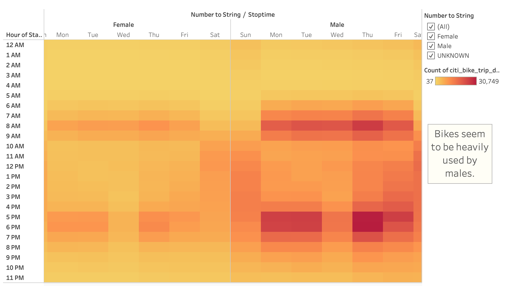

# Citi Bike Research
## Overview
### Purpose
After an exciting trip to New York City with my friend Kate, we started looking through photos and realized how big an impact the use of Citi Bikes had on our experience. Following a discussion, we decided we wanted to explore the possiblity of starting our own bike sharing company in our hometown of Des Moines, Iowa. After finding a potential angel investor for our business, we decided to do a deep dive into the publicly avaialbe NYC Citi Bike data to get an idea of whether or not a Des Moines based bike sharing business could be successful. After figuring out how the NYC bike-sharing business works, we worked on gearing it toward projections in Des Moines for our potential investor. Through the use of Tableau, we used the story functionality and the visualization tools to sell our prospective business to our investors in the hopes that our Des Moines Citi Bike can soon be a reality. 

## Results

## Summary

